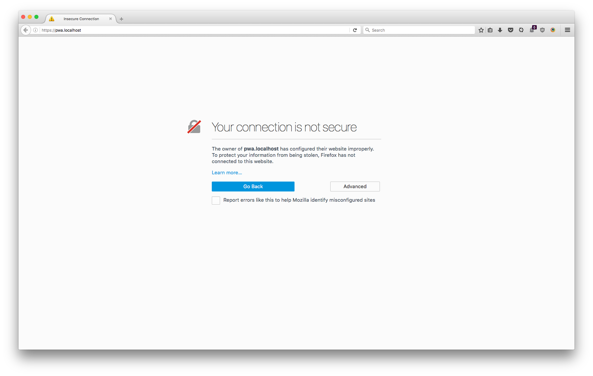
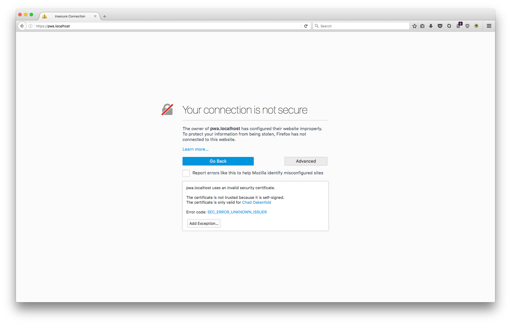
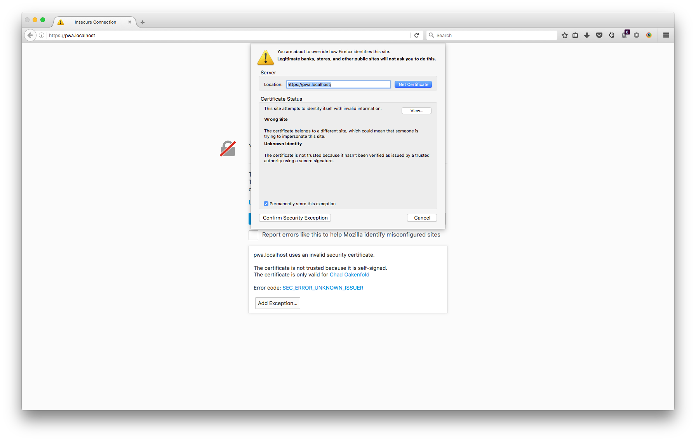
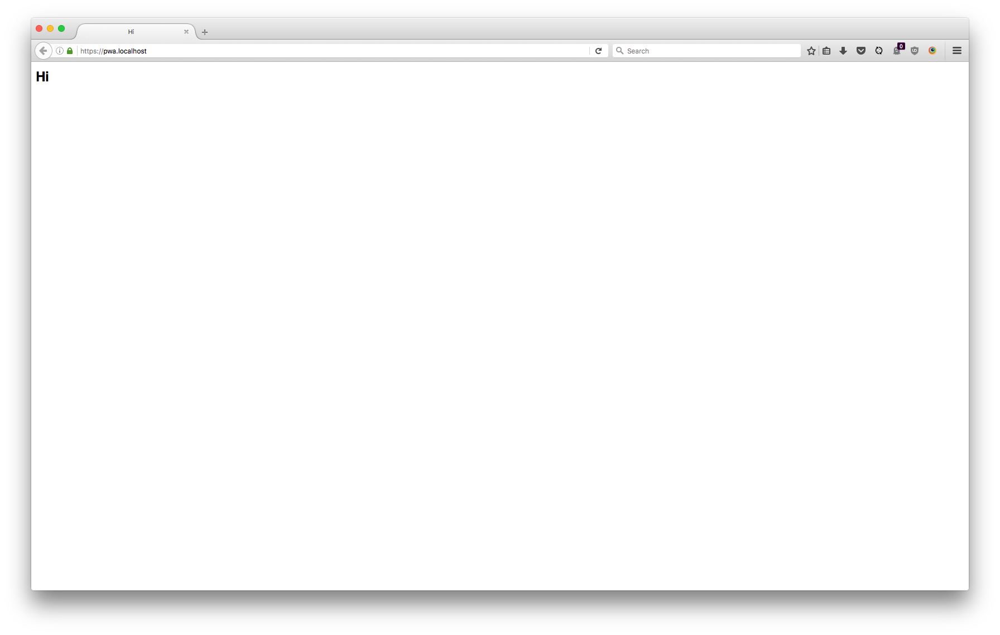
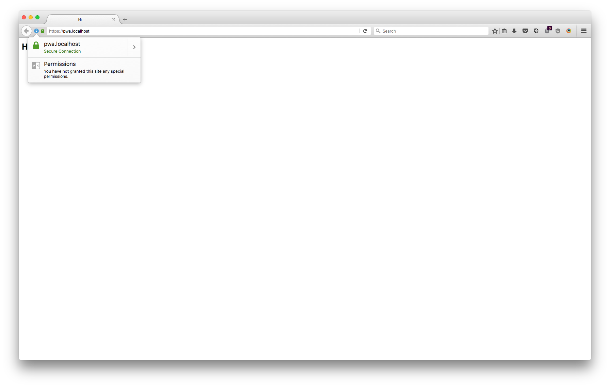
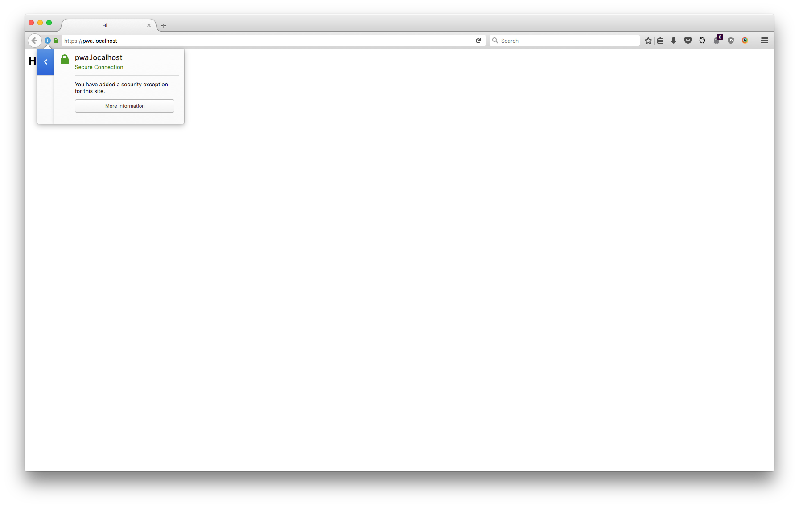

Running HTTPS locally
=====================


# Apache config changes

Informed by [Apache: Enable HTTPS Locally](http://www.dinduks.com/apache-enable-https-locally/) with some original content around open ssl setup & ssl cert generation, hosts/vhosts.

## Reminders about my system
- Apache: `/private/etc/apache2/`
- `/private/etc/apache2/httpd.conf`
- `/private/etc/apache2/extra/httpd-vhosts.conf`

## Enable Apache’s SSL mod

> If you installed Apache in some other way, enable the SSL mod manually.

- `edit_apache`
- httpd.conf in sublime
- search for 'ssl'
- uncommented `LoadModule ssl_module libexec/apache2/mod_ssl.so`


## Ask Apache to listen on the port 443
> 443 is the default SSL port. Ask Apache to listen on it by adding Listen 443 in your config file (httpd.conf for example). 

- `edit_apache`
- httpd.conf in sublime
- search for 'Listen'
- added a line `Listen 443'


## Create an SSL certificate
Using Openssl to generate my own self signed certificate.

- tested `make-ssl-cert` (from above article), not on my system
- went to [openssl](https://github.com/openssl/openssl/blob/master/INSTALL) github
- tested dependencies
  - `which make`
  - `perl --version`
  - "The perl module Text::Template (please read NOTES.PERL)"
    - just going to hope and assume the above module
- created a folder in `~/Documents/WebDevelopment/Oakenfold_Enterprises_Ltd/Website/Source`
- `git clone https://github.com/openssl/openssl`
- `cd /Users/Chad/Documents/WebDevelopment/Oakenfold_Enterprises_Ltd/Website/Source/openssl`

```
If you want to just get on with it, do:

  on Unix:

    $ ./config
    $ make
    $ make test
    $ make install
``` 

- Had to `sudo make install` due to copy permission
- ` openssl req -x509 -newkey rsa:2048 -nodes -keyout key.pem -out cert.pem -days 365`
[- @stackoverflow](http://stackoverflow.com/questions/10175812/how-to-create-a-self-signed-certificate-with-openssl)

```
Country Name (2 letter code) [AU]:CA
State or Province Name (full name) [Some-State]:British Columbia
Locality Name (eg, city) []:Nanaimo
Organization Name (eg, company) [Internet Widgits Pty Ltd]:Oakenfold Enterprises Ltd.
Organizational Unit Name (eg, section) []:Web Development
Common Name (e.g. server FQDN or YOUR name) []:Chad Oakenfold
Email Address []:REDACTED@REDACT.ED
```

```
~/Documents/WebDevelopment/Oakenfold_Enterprises_Ltd/Website/Source/selfSignedCertificates$ ls -l
total 16
-rw-r--r--  1 Chad  staff   1.5K Jun  8 22:38 cert.pem
-rw-------  1 Chad  staff   1.7K Jun  8 22:37 key.pem
```

## Setup your application’s virtual host

- `edit_hosts`
- added: `127.0.0.1 pwa.localhost`
- `edit_vhosts`

```
<VirtualHost pwa.localhost:443>
  DocumentRoot /Users/Chad/Documents/WebDevelopment/Oakenfold_Enterprises_Ltd/Website/pwa/
  
  ServerAlias pwa.localhost
  ErrorLog "/Users/Chad/Documents/WebDevelopment/Oakenfold_Enterprises_Ltd/Website/pwa/Logs/ErrorLog"
  ServerName pwa.localhost

  SSLEngine on
  SSLCertificateFile /Users/Chad/Documents/WebDevelopment/Oakenfold_Enterprises_Ltd/Website/Source/selfSignedCertificates/cert.pem
  SSLCertificateKeyFile /Users/Chad/Documents/WebDevelopment/Oakenfold_Enterprises_Ltd/Website/Source/selfSignedCertificates/key.pem
  
  <Directory "/Users/Chad/Documents/WebDevelopment/Oakenfold_Enterprises_Ltd/Website/pwa">
    Allow from all
    AllowOverride All
    Options Indexes FollowSymLinks Includes ExecCGI
    Order deny,allow
    Require all granted
  </Directory>

</VirtualHost>
```

## Starter up

- `start_apache`
- [https://pwa.localhost](https://pwa.localhost/)
- Using Firefox, accept invalid certificate
- 
- 
- 
- 
- 
- 